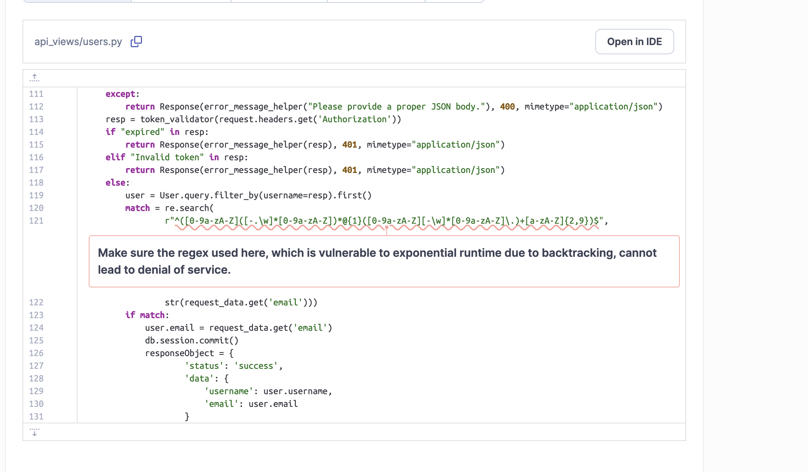
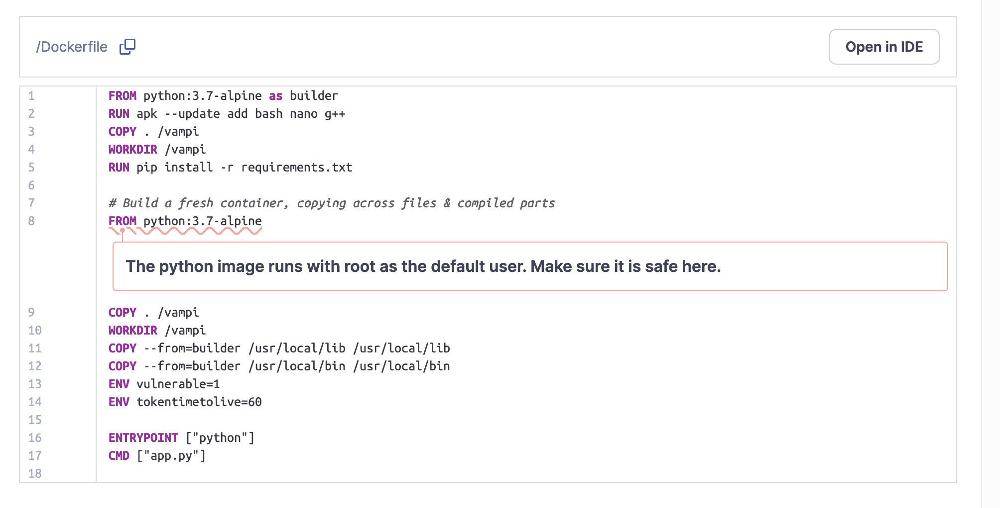

# Secure coding

## Module 1

Three vulnerbilities I would point out I discovered


- SQL injection
Using payload  John.Doe) AND 3059=3059 AND (8996=8996 we are able to preform SQL Injection to manipulate logic and preform operations on database
Code like this below

```python
    @staticmethod
    def get_user(username):
        user_query = f"SELECT * FROM users WHERE username = '{username}'"
        query = db.session.execute(text(user_query))
```

Allows the attacker to directly execute commands in the database. We do not sanitize the input here, as we should. Fixing this requires us to check the information being sent from the client and sanitize it properly.

--FIX--

By utilizing SQLAlchemy ORM, our input that is sent via request is sanitized, eliminating the danger of someone executing some unwanted code on our database. We also sanitize the input to be extra sure no SQL injection attack can be preformned

- Server Leaks Version Information via "Server" HTTP Response Header Field
The web/application server is leaking version information via the “Server” HTTP response header. Access to such information may facilitate attackers identifying other vulnerabilities your web/application server is subject to.

--FIX--

We can tackle this by changing the `Server` header to obscure what server version we are using

```python
def remove_server_header(app):
    @app.after_request
    def apply_custom_headers(response):
        response.headers.pop("Server", None)
        return response
```

- HTTP Only Site

Site is served only through localhost and through HTTP, we should enable encryption and provide a HTTPS certificate (for example, use Let's encrypt certificates through Certbot or similar)

## Module 2

Using SonarQube we revealed a few possible issues

- Possible DOS attack through usage of regex

- Possible unsecure random number generator

- Python image runs as root user, possibly exposing vulnerbilities through it

